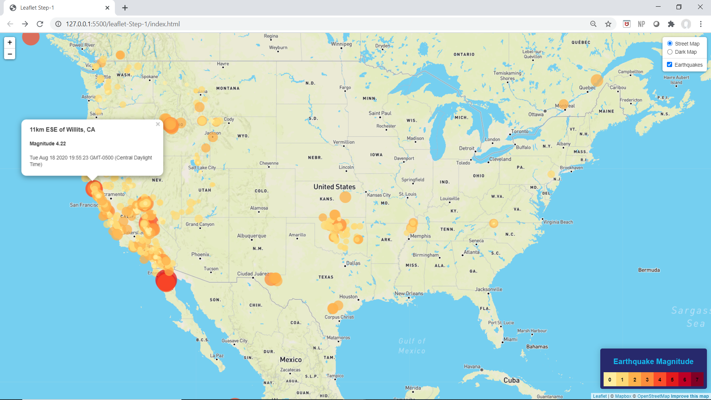
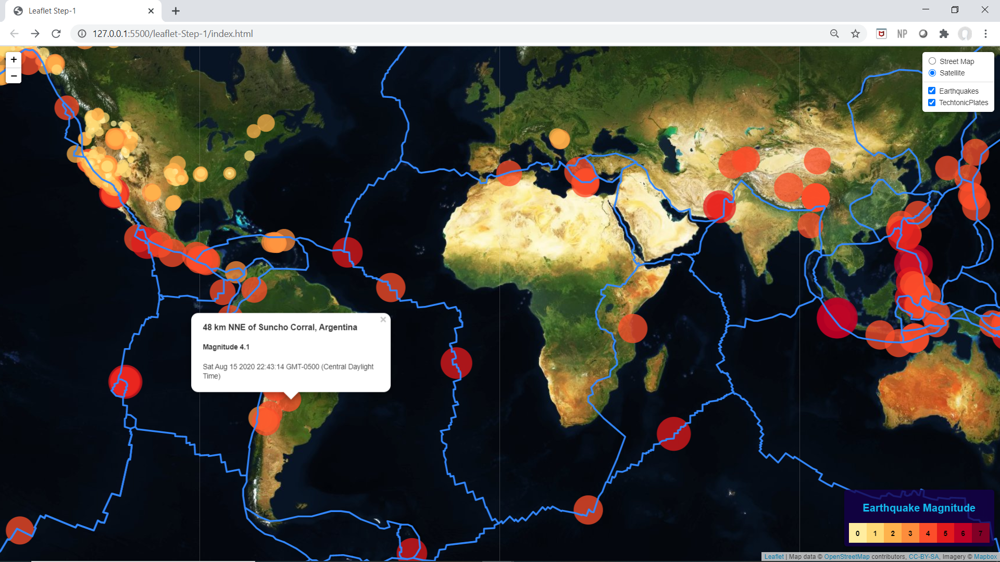

# Leaflet-Challenge
[US Earthquake Map](https://carleeyoung.github.io/Leaflet-Challenge/leaflet-Step-1/)
[World Earthquake Map](https://carleeyoung.github.io/Leaflet-Challenge/leaflet-Step-2/)
Visuallizing Data with Leaflet

Two maps were created using data from the USGS for earthquake magnitude and location over the past seven days.
The first map shows the earthquakes in the North American region with circle markers showing the location and 
magnitude of each earthquake.  The larger the circle and darker the shade, the high magnitude or stronger the 
earthquake.  This map also shows detailed information when you click on an individual earthqauke marker.  There
is a legend with a key for magnitude and color.  Additionally, the map has the capability of switching from the
default street map style view to a dark map view using the control box in the upper right corner.  This control
box also allows you to toggle the earthquake markers on and off.

The second map shows a global image of earthquakes in the past 7 days and techtonic plate boundaries.  Circle
markers change in size and color depending on the magnitude of the earthquake.  The weakest earthquakes are 
shown in small light orange and the strongest in large dark red circles.  Information about each earthquake is
provided when the circle marker is clicked on.  The map options are satellite or street view and these can be
toggled on or off using the control key in the upper right hand corner.  Earthquake markers and techtonic plate
boundaries can also be toggled on and off using the same control key.  The legend shows magnitude and color
correlation for each earthquake.  

